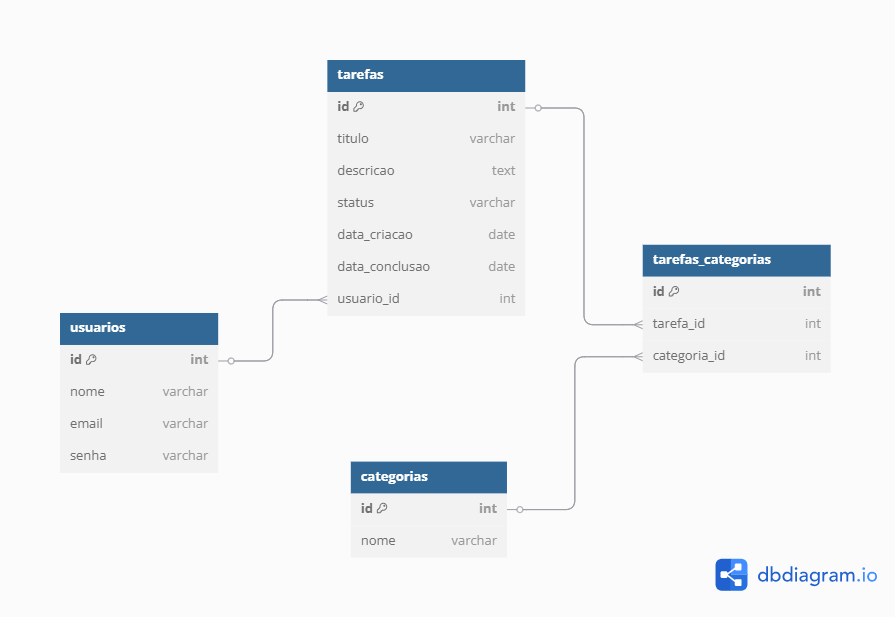

## Modelo de Dados

O modelo lógico do banco de dados está representado no diagrama abaixo:

### Entidades principais:

- **Usuários** (`usuarios`)

  - `id`, `nome`, `email`, `senha`

- **Tarefas** (`tarefas`)

  - `id`, `titulo`, `descricao`, `status`, `data_criacao`, `data_conclusao`, `usuario_id`

- **Categorias** (`categorias`)

  - `id`, `nome`

- **Relação Tarefa-Categoria** (`tarefas_categorias`)
  - `id`, `tarefa_id`, `categoria_id`

O relacionamento entre as tabelas permite que:

- Um usuário tenha várias tarefas;
- Uma tarefa possa pertencer a várias categorias;
- Uma categoria possa agrupar várias tarefas.
